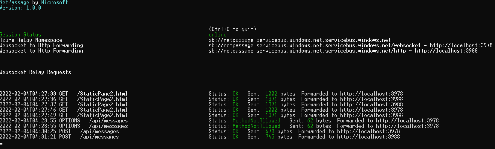
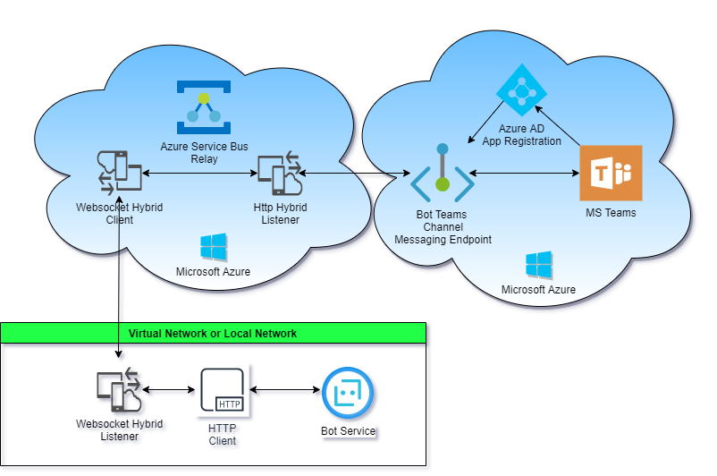

# Overview

**NetPassage** allows you to expose a web service, such as Microsoft Bot running on your local machine or on the private network to the public cloud endpoint, such as Bot Channel Registration Messaging endpoint, for example, via Azure Service Bus Relay.

This client side utility supports both `Http` and `WebSocket` connectivity with the cloud based Relay.

It is useful for debug scenarios or for more complex situations where the BotEmulator is not enough (i.e.: you use the WebChat control hosted on a site and you need to receive ChannelData in your requests).

When you start `NetPassage`, it will display a UI in your terminal with the public URL of your tunnel and other status and metrics information about connections made over your tunnel.

## Architecture

`NetPassage` uses Microsoft Azure Service Bus Relay to tunnel all incoming
messages thru the Relay's hybrid connections (either Websocket or Http) and to
the remotely running (e.g. local) `NetPassage` client utility's listener, as
shown in the architecture diagram below:

## How to configure and run the utility

The `NetPassage` utility is constructed from the following parts:

1. NetPassage client console app
2. Microsoft.HybridConnectionsRelay a server side job (deployed to Azure)
3. Microsoft.HybridConnections.Core

### Building with Microsoft Visual Studio 2019

>Note: If you plan on using only Http tunnel protocol, then you would only need to build the NetPassage and Microsoft.HybridConnections.Core projects. Then you would start NetPassage project only.

1. Once the solution has been cloned to your machine, open the solution in Visual Studio.

2. In Solution Explorer, expand the **NetPassage** folder.

3. Clone the **NetPassage.json.template** file into **NetPassage.json** and replace the following values with those from your Azure Service
Bus.

    a. `Namespace` is the name of your Azure Service Bus Relay. Enter the same value for both Http and Websocket sections.

    b. Under **Http** section, `ConnectionName` is the name of the Hybrid Connection used for Http relay. And Under **Websocket** section, `ConnectionName`  is the name of the Hybrid Connection used for Websocket relay.

    c. "PolicyName" is the value to the shared access policy for each of the Hybrid Connections you've entered earlier.

    d. "PolicyKey" is the secret key value for the shared access policy.

    e. "TargetServiceAddress" sets the port to be used for localhost. The address and port number should match the address and port used by your bot. For example, `http://localhost:[PORT]`.

If you're going to use the `Websocket` relay, you'd also need to update the values in the **appsettings.json** for the `Microsoft.HybridConnections.Relay` project.

1. In Solution Explorer, expand the **Microsoft.HybridConnections.Relay** folder.

2. Clone the **appsettings.json.template** file into **appsettings.json** and replace the following values with those from your Azure Service
Bus.

    a. `Namespace` is the name of your Azure Service Bus Relay. Enter the same value for both Http and Websocket sections.

    b. Under **Listener** section, `ConnectionName` is the name of the Hybrid Connection used for Http relay. And Under **Relay** section, `ConnectionName`  is the name of the Hybrid Connection used for Websocket relay.

    c. "PolicyName" is the value to the shared access policy for each of the Hybrid Connections you've entered earlier.

    d. "PolicyKey" is the secret key value for the shared access policy.

    e. "TargetServiceAddress" sets the port to be used for localhost. The address and port number should match the address and port used by your bot. For example, `http://localhost:[PORT]`.

Before testing the relay, your Azure Web Bot's messaging endpoint must be updated to match the relay.

1. Login to the Azure portal and open your Web App Bot.

2. Select **Settings** under Bot management to open the settings blade.

3. In the **Messaging endpoint** field, enter the service bus namespace and relay. The relay should match the relay `ConnectionName` entered in the **NetPassage.json** file and should not exist in Azure.

4. Append **"/api/messages"** to the end to create the full endpoint to be used. For example, `https://example-service-bus.servicebus.windows.net/websocketrelay/api/messages`.

5. Click **Save** when completed.

Now, back to the Visual Studio.

1. In Visual Studio, if you want to run in `Websocket` mode, make sure both `NetPassage` and `Microsoft.HybridConnections.Relay` projects are selected to start. Then, press **F5** to run both projects.
And, if you're planning on using only `Http` mode, you should only run `NetPassage` project.

2. Open and run your locally hosted bot.

3. Test your bot on a channel (Test in Web Chat, Skype, Teams, etc.). User data is captured and logged as activity occurs.

    - When using the Bot Framework Emulator: The endpoint entered in Emulator must be the service bus endpoint saved in your Azure Web Bot **Settings** blade, under **Messaging Endpoint**.

4. Once testing is completed, you can compile the project into an executable.

    a. Right click the project folder in Visual Studio and select **Build**.

    b. The .exe will output to the **/bin/debug** folder, along with other necessary files, located in the project’s directory folder. All the files are necessary to run and should be included when moving the .exe to a new folder/location.
    - The **app.config** is in the same folder and can be edited as credentials change without needing to recompile the project.

### Building with Visual Studio for Mac

When building the solution on Mac, the steps are largely the same as shown above with a couple things to keep note of:

1. The **appsettings.json** file may not automatically get moved into **/bin** after building by default. It is required, so ensure it is being properly copied over during build if you run into issues.

2. The `NetPassage` default run configuration may not pass in the required configuration file by default. To fix this, ensure "**NetPassage.json**" is being passed into your default Run Configuration.

    a. Right click the project folder in Visual Studio for Mac and select **Options**.

    b. Under **Run**, select the **Default** configuration.

    c. In the **Arguments** field, enter "**NetPassage.json**".

    d. Select **OK** and retry running `NetPassage` via Visual Studio for Mac.

## Acknowledgments

Part of this code is based on the work that [Gabo Gilabert](https://github.com/gabog) did in his project [here](https://github.com/gabog/AzureServiceBusBotRelay).
