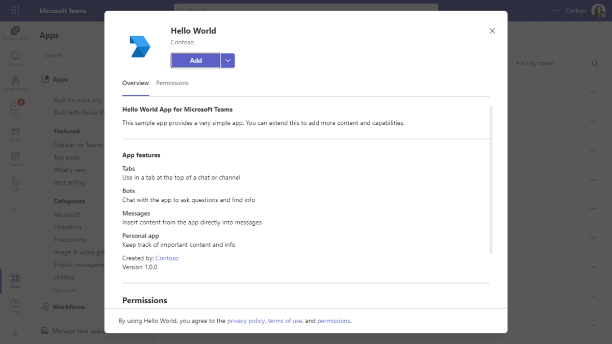
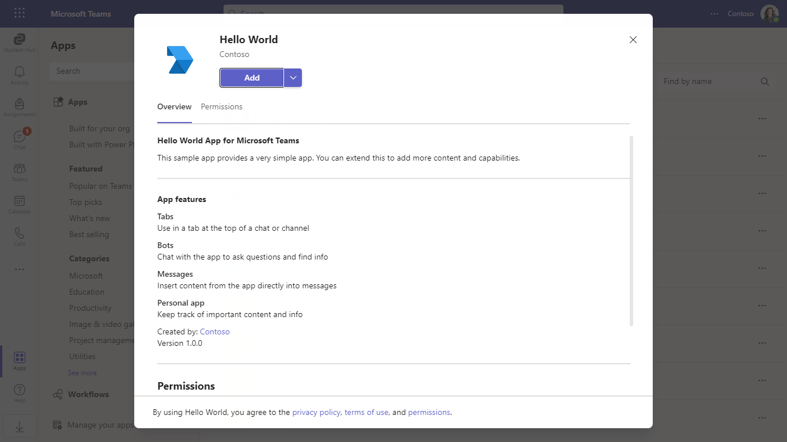
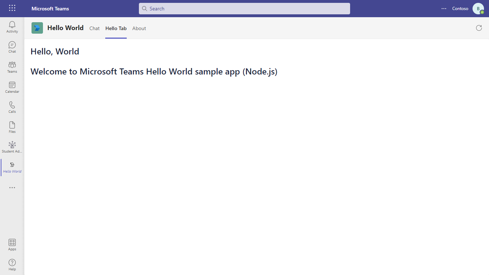

# Microsoft Teams hello world sample app using NetPassage

- Microsoft Teams hello world sample app using NetPassage.

## Interaction with app



## Try it yourself - experience the App in your Microsoft Teams client

Please find below demo manifest which is deployed on Microsoft Azure and you can try it yourself by uploading the app package (.zip file link below) to your teams and/or as a personal app. (Sideloading must be enabled for your tenant, [see steps here](https://docs.microsoft.com/microsoftteams/platform/concepts/build-and-test/prepare-your-o365-tenant#enable-custom-teams-apps-and-turn-on-custom-app-uploading)).

**Microsoft Teams hello world sample app:** [Manifest](/samples/app-hello-world/csharp/demo-manifest/app-hello-world.zip)

## Prerequisites

- Microsoft Teams is installed and you have an account (not a guest account)

- To test locally, [NodeJS](https://nodejs.org/en/download/) must be installed on your development machine (version 16.14.2  or higher)

- [NetPassage](https://github.microsoft.com/netpassage) tunneling solution

- [M365 developer account](https://docs.microsoft.com/microsoftteams/platform/concepts/build-and-test/prepare-your-o365-tenant) or access to a Teams account with the appropriate permissions to install an app.

## Setup

> Note these instructions are for running the sample on your local machine, the tunnelling solution is required because the Teams service needs to call into the bot.

### 1. Setup for Bot

- In Azure portal, create a [Azure Bot resource](https://docs.microsoft.com/azure/bot-service/bot-builder-authentication?view=azure-bot-service-4.0&tabs=csharp%2Caadv2)

- Ensure that you've [enabled the Teams Channel](https://docs.microsoft.com/azure/bot-service/channel-connect-teams?view=azure-bot-service-4.0)

- While registering the bot, use `https://netpassagerelay.servicebus.windows.net/websocket/api/messages` as the messaging endpoint.
    > NOTE: When you create your bot you will create an App ID and App password - make sure you keep these for later.

### 2. Start NetPassage

1) Deploy Azure Relay into your Azure subscription and create Hybrid Connection for your Bot endpoint. Follow the instructions in this document: [Microsoft Learn](https://learn.microsoft.com/en-us/azure/azure-relay/relay-hybrid-connections-http-requests-dotnet-get-started)
2) Clone `.env.template` to `.env`
3) Enter the values from your Azure Relay and Hybrid Connection to the appropriate fields
4) Change the `targetHttp` port to 3333 to match this sample app: `targetHttp=http://localhost:3333`
5) Install npm package for NetPassage Node

    ```bash
    yarn / npm i
    ```

6) Run NetPassage in Node:

    ```bash
    yarn start / npm start
    ```

### 3. Setup for code

1) In a terminal, navigate to `samples/node/helloWorld`

2) Install modules

    ```bash
    npm install
    ```

3) Update the `custom-environment-variables` configuration for the bot to use the `MicrosoftAppId` and `MicrosoftAppPassword`, `BaseUrl` with application base url.

5) Update the `default` configuration for the bot to use the `appId` and `appPassword`.

5) Run your app

    ```bash
    npm start
    ```

### 4. Setup Manifest for Teams

- **This step is specific to Teams.**

  - **Edit** the `manifest.json` contained in the `app-hello-world/nodejs/appPackage` folder to replace your Microsoft App Id (that was created when you registered your bot earlier) *everywhere* you see the place holder string `<<Your Microsoft App Id>>` (depending on the scenario the Microsoft App Id may occur multiple times in the `manifest.json`)
  - **Edit** the `manifest.json` for `configurationUrl` inside `configurableTabs` . Replace `{{domain-name}}` with base Url domain and `{{hybrid-connection}}` with your Hybrid Connection. E.g. if your created Azure Relay namespace is `netpassage` and your Hybrid Connection name is `websocket` then your domain-name will be `netpassagerelay.servicebus.windows.net/websocket`.
    - **Edit** the `manifest.json` for `validDomains` with base Url domain. E.g.  if your created Azure Relay namespace is `netpassage` then your domain-name will be `netpassagerelay.servicebus.windows.net`.

    - **Zip** up the contents of the `helloWorld/appPackage` folder to create a `manifest.zip` or `helloWorld/Manifest_hub` folder into a `Manifest_Hub.zip`.(Make sure that zip file does not contains any subfolder otherwise you will get error while uploading your .zip package)
    - **Upload** the `manifest.zip` to Teams (In Teams Apps/Manage your apps click "Upload an app". Browse to and Open the .zip file. At the next dialog, click the Add button.)
    - Add the app to personal/team/groupChat scope (Supported scopes)

>**Note**: If you are facing any issue in your app, please uncomment [this](./src/bot.js#L38) line and put your debugger for local debug.

## Running the sample

**Install App:**



**Welcome UI:**



## Deploy the bot to Azure

To learn more about deploying a bot to Azure, see [Deploy your bot to Azure](https://aka.ms/azuredeployment) for a complete list of deployment instructions.
